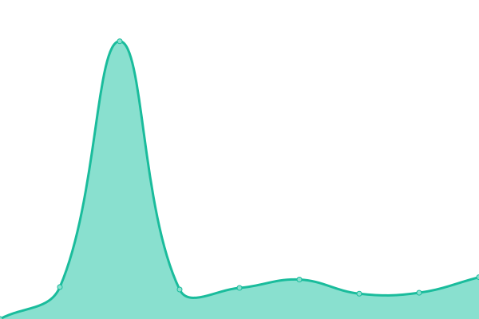

# [📈 Live Status](https://demo.upptime.js.org): <!--live status--> **🟧 Partial outage**

This repository contains the open-source uptime monitor and status page for [Upptime](https://upptime.js.org), powered by [Upptime](https://github.com/upptime/upptime).

With [Upptime](https://upptime.js.org), you can get your own unlimited and free uptime monitor and status page, powered entirely by a GitHub repository. We use [Issues](https://github.com/upptime/upptime/issues) as incident reports, [Actions](https://github.com/HEALFORM/status/actions) as uptime monitors, and [Pages](https://demo.upptime.js.org) for the status page.

<!--start: status pages-->
<!-- This summary is generated by Upptime (https://github.com/upptime/upptime) -->
<!-- Do not edit this manually, your changes will be overwritten -->
<!-- prettier-ignore -->
| URL | Status | History | Response Time | Uptime |
| --- | ------ | ------- | ------------- | ------ |
|  [HEALFORM](https://www.healform.de) | 🟩 Up | [healform.yml](https://github.com/HEALFORM/status/commits/HEAD/history/healform.yml) | 

 764ms
     
 | 

<a href="https://HEALFORM.github.io/status/history/healform">100.00%</a>
    

|  [myHEALFORM](https://my.healform.de) | 🟩 Up | [my-healform.yml](https://github.com/HEALFORM/status/commits/HEAD/history/my-healform.yml) | 

 751ms
     
 | 

<a href="https://HEALFORM.github.io/status/history/my-healform">100.00%</a>
    

|  [HEALFORM Chat](https://chat.healform.de) | 🟩 Up | [healform-chat.yml](https://github.com/HEALFORM/status/commits/HEAD/history/healform-chat.yml) | 

 591ms
     
 | 

<a href="https://HEALFORM.github.io/status/history/healform-chat">100.00%</a>
    

|  [HEALFORM Display-Widget](https://display-widget.healform.de) | 🟥 Down | [healform-display-widget.yml](https://github.com/HEALFORM/status/commits/HEAD/history/healform-display-widget.yml) | 

 593ms
     
 | 

<a href="https://HEALFORM.github.io/status/history/healform-display-widget">0.00%</a>
    

|  [HEALFORM Franchise](https://franchise.healform.de) | 🟥 Down | [healform-franchise.yml](https://github.com/HEALFORM/status/commits/HEAD/history/healform-franchise.yml) | 

 0ms
     
 | 

<a href="https://HEALFORM.github.io/status/history/healform-franchise">0.00%</a>
    

|  [HEALFORM Liquid](https://liquid.healform.de) | 🟥 Down | [healform-liquid.yml](https://github.com/HEALFORM/status/commits/HEAD/history/healform-liquid.yml) | 

 0ms
     
 | 

<a href="https://HEALFORM.github.io/status/history/healform-liquid">0.00%</a>
    

|  [HEALFORM Server](https://api.healform.de) | 🟥 Down | [healform-server.yml](https://github.com/HEALFORM/status/commits/HEAD/history/healform-server.yml) | 

 620ms
     
 | 

<a href="https://HEALFORM.github.io/status/history/healform-server">0.00%</a>
    

|  [HEALFORM Support-Center](https://support.healform.de) | 🟥 Down | [healform-support-center.yml](https://github.com/HEALFORM/status/commits/HEAD/history/healform-support-center.yml) | 

 0ms
     
 | 

<a href="https://HEALFORM.github.io/status/history/healform-support-center">0.00%</a>
    

<!--end: status pages-->

[**Visit our status website →**](https://demo.upptime.js.org)

## 📄 License

- Powered by: [Upptime](https://github.com/upptime/upptime)
- Code: [MIT](./LICENSE) © [Upptime](https://upptime.js.org)
- Data in the `./history` directory: [Open Database License](https://opendatacommons.org/licenses/odbl/1-0/)
